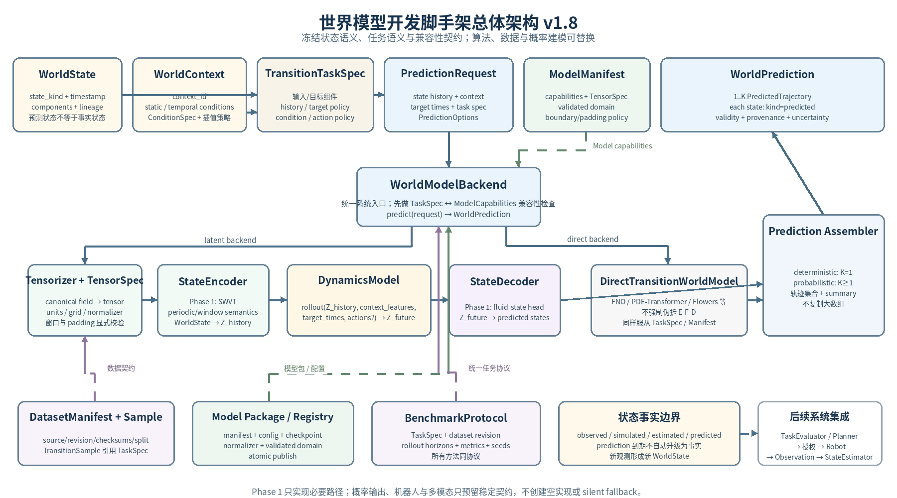
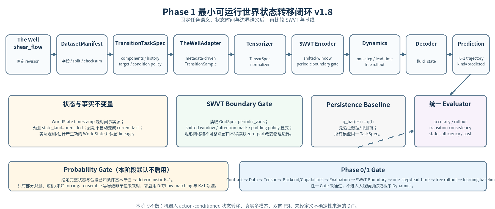

**海洋机器人世界模型  
开发架构文档**

Scaffold-first Architecture for World-State Transition Modeling

| 属性         | 内容                                                                                     |
|--------------|------------------------------------------------------------------------------------------|
| 文档版本     | v1.8                                                                                     |
| 日期         | 2026-09-10                                                                               |
| 项目定位     | 面向海洋机器人的世界模型                                                                 |
| 第一阶段     | 仿真环境状态转移预测                                                                     |
| 当前算法起点 | 现有研究资产：Shifted-Window ViT（SWVT，待统一接口适配与验证）                           |
| 首选主数据   | The Well / shear_flow                                                                    |
| 第二验证数据 | The Well / rayleigh_benard                                                               |
| 文档目的     | 冻结状态/时间/组件/兼容性契约；分离物理上下文与数据 provenance；保持模型与训练策略可替换 |

| 核心决策：初期脚手架优先于大规模训练。v1.8 进一步冻结“事实状态 / 预测状态”“任务语义 / 模型能力”“物理条件 / 推理选项”三组边界；WorldPrediction 使用 1..K 条轨迹统一确定性与后续概率输出。SWVT、PDE-Transformer、FNO、DiT/flow matching 仍是可替换实现。 |
|--------------------------------------------------------------------------------------------------------------------------------------------------------------------------------------------------------------------------------------------------------|

# 1. 文档目标与结论

本文给出世界模型第一阶段到后续机器人世界模型扩展的开发架构。内容基于当前项目目标及互联网调研，重点不是选定“唯一最强网络”，而是建立可以持续替换数据、状态表征、动力学算法和预测目标的工程脚手架。

- 世界模型研究对象固定为“状态及其转移”，而不是某一种输入模态或某一种网络。

- 第一阶段仅激活 environment.fluid_state 状态分支，训练和验证仿真环境状态转移；“激活”表示阶段范围，不表示对应实现已经完成。

- SWVT 是现有研究资产与 Phase 1 主候选，不是永久接口；DiT、PDE-Transformer、FNO、Flowers 等通过统一 Backend / Dynamics 接口进入。

- 真实视频、声呐、机器人状态、动作条件和流固耦合后续逐步扩展，不进入 Phase 1 的验收范围。

- 所有预测都必须携带状态时间、空间参照、模型/数据版本、适用范围与 provenance；核心推理接口必须显式输入全部正确性所需状态，不依赖隐藏会话缓存；预测失败不能被解释为“安全”。

v1.8 在 v1.7 基础上完成一次“单一事实源”复核：TransitionTaskSpec 只定义要预测什么和怎样转移，不再反向引用评测协议；新增独立 BenchmarkProtocol，统一冻结 task、dataset revision、split、rollout horizon、metrics、seeds 与预算。PredictionRequest 必须携带 inline/ref 二选一的 WorldContext 与 TransitionTaskSpec，并移除与 TaskSpec 重复的 requested_components / rollout_mode；PredictionOptions 只保留输出模式、轨迹数和随机种子等非物理推理选项。同时修正模型层小节编号，并把 TaskSpec ↔ ModelCapabilities 兼容性检查提升为 WorldModelBackend 前向前的强制 Gate。v1.7 的 state_kind/lineage、1..K PredictedTrajectory、ConditionSpec 与 SWVT Boundary Gate 继续保持。

# 2. 互联网调研对架构设计的直接启发

| 来源             | 调研事实                                                                                                           | 对本项目的架构结论                                                                                 |
|------------------|--------------------------------------------------------------------------------------------------------------------|----------------------------------------------------------------------------------------------------|
| DreamerV3        | 编码观测形成内部状态；学习动作条件下的状态演化；世界模型与 actor/critic 分离。                                     | 世界模型只负责状态/后果预测；评估与决策保持外置。\[R1\]                                            |
| DINO-WM          | 使用预训练空间 patch 特征预测未来特征，并在测试时做动作序列优化。                                                  | 预测表征可以与规划接口解耦；离线轨迹可训练 world dynamics。\[R2\]                                  |
| AROMA            | 灵活 encoder-decoder + 空间 latent + conditional Transformer dynamics；支持 irregular grid / point cloud。         | 编码器、潜在空间和 Dynamics 应独立可替换；未来可接稀疏/不规则观测。\[R3\]                          |
| Poseidon / ScOT  | 多尺度 operator Transformer；time-conditioned layer norm；利用 time-dependent PDE 的半群性质。                     | target time / lead time 应成为正式条件；“状态转移算子”应支持不同时间跨度。\[R4\]                   |
| PDE-Transformer  | 规则网格物理预测；multi-scale；shifted-window；多物理通道；conditioning；监督与 flow matching 两类目标。           | SWVT 路线合理，但需面向物理场重构；生成式 Dynamics 应作为可插拔训练/推理模式。\[R5\]               |
| The Well         | 统一 HDF5 数据规范、PyTorch Dataset、固定时间采样、统一 benchmark；配置驱动训练。                                  | DataAdapter 与模型解耦；TransitionSample 应包含 fields、conditions、space/time grids。\[R6\]\[R7\] |
| Flowers          | 独立于 Fourier / attention / convolution mixing 的 warp-based PDE operator；官方仓库将 data/model/train 配置分开。 | 需要保留 DirectTransitionWorldModel 路径，不能强迫所有 baseline 走 E-F-D latent 架构。\[R8\]       |
| Swin Transformer | shifted windows 降低注意力计算并建立跨窗口连接。                                                                   | SWVT 可继续作为第一阶段 spatial backbone，但窗口移位本身不是时间状态转移。\[R9\]                   |

| 关键判断：文献并未支持“世界模型必须使用 DiT”或“SWVT 必然最优”。更一致的工程启示是：把状态、条件、Dynamics、Decoder、Planning 接口拆开，并让训练数据与模型配置可独立替换。 |
|---------------------------------------------------------------------------------------------------------------------------------------------------------------------------|

# 3. 总体架构原则

| 原则                               | 要求                                                                                                                                                |
|------------------------------------|-----------------------------------------------------------------------------------------------------------------------------------------------------|
| P-01 语义先行                      | 先定义 WorldState 与 Transition，再定义 Tensor shape。                                                                                              |
| P-02 接口冻结、算法开放            | 冻结请求/响应与状态语义；不冻结 SWVT、latent 维数、历史长度、预测长度、loss。                                                                       |
| P-03 Observation ≠ State           | 传感器数据是观测；仿真完整场可在 Phase 1 直接映射为环境状态。                                                                                       |
| P-04 Prediction ≠ Decision         | World Model 预测未来；SEAgent Task Evaluator / Planner 做判断与方案选择。                                                                           |
| P-05 Latent 与 Direct Backend 共存 | SWVT/DiT 可走 latent；FNO/Flowers 等可直接完成 state-to-state operator。                                                                            |
| P-06 时间是一等条件                | history time、target time、Δt/lead time 进入契约与模型，不只用“帧号”。                                                                              |
| P-07 明确适用范围                  | 预测必须声明 horizon、物理参数、空间域和输入质量是否处于验证范围。                                                                                  |
| P-08 Fail Closed                   | 模型加载失败、数据 schema 不匹配或超出验证域时返回明确错误，不 silent dummy fallback。                                                              |
| P-09 可复现                        | config、seed、dataset version、checkpoint hash、code commit 一并保存。                                                                              |
| P-10 阶段隔离                      | Phase 1 不因未来多模态愿景而引入不必要的机器人、视频、FSI 复杂度。                                                                                  |
| P-11 时间单一事实源                | 历史/目标 WorldState 的 timestamp 是状态时间权威来源；PredictionRequest 只拥有尚不存在目标状态时的 target_times。                                   |
| P-12 能力声明先于推理              | 每个可部署模型必须提供 ModelManifest，声明 schema 兼容、必需 component/context、时间策略、网格约束与 validated domain。                             |
| P-13 核心推理无隐藏状态            | WorldModelBackend.predict(request) 的正确性只依赖显式 request + model package；缓存只能优化性能，不能改变语义或结果来源。                           |
| P-14 物理上下文 ≠ 数据 provenance  | WorldContext 只描述影响状态演化的物理/几何/时间条件；dataset revision、split、license、checksum 属于 DatasetManifest / provenance，不进入物理条件。 |
| P-15 顶层契约显式版本化            | 跨进程/落盘的顶层 contract 直接携带 schema_version；嵌套值对象默认随父契约演进，独立持久化时再单独版本化。                                          |
| P-16 顶层载荷自描述                | 跨进程/落盘 contract 使用 contract_type + schema_version；禁止仅靠 API 路径、Python 类名或 shape 判断 payload 类型。                                |
| P-17 条件与结果身份可追溯          | WorldContext 使用 context_id；静态与时变条件键互斥；WorldPrediction 使用 prediction_id + generated_at，并引用实际 context。                         |
| P-18 预测不等于事实                | WorldState.state_kind 明确 simulated/observed/estimated/predicted；预测状态到期不自动写入当前事实状态。                                             |
| P-19 任务语义独立                  | TransitionTaskSpec 定义同一研究/benchmark 要预测什么；ModelCapabilities 只声明模型能做什么，禁止模型各自改变任务。                                  |
| P-20 概率输出轨迹化                | WorldPrediction 使用 1..K 条 PredictedTrajectory；确定性 K=1，概率 K\>1；采样与 calibration 分离。                                                  |
| P-21 条件插值显式                  | ConditionSeries 必须声明 interpolation/extrapolation/availability；禁止静默外推或把非法未来 forcing 当输入。                                        |
| P-22 边界语义进入模型能力          | SWVT/FNO 等必须声明 periodic/grid/padding 能力；周期域的 shifted window 不得被普通 zero padding 悄然改变。                                          |

图 1 世界模型开发脚手架总体架构（v1.8 目标架构；TaskSpec/Capabilities、事实状态与 1..K 轨迹输出）

# 4. 核心领域模型与稳定契约

以下契约是第一阶段最值得冻结的部分。Python dataclass / Pydantic 仅为推荐实现方式；真正需要冻结的是字段语义、版本策略与错误行为。v1.8 决定：所有跨进程、落盘或进入 Registry 的顶层契约同时携带 contract_type 与 schema_version，形成可自描述载荷；ConditionSeries、FluidState、FieldRef 等嵌套值对象默认由所属顶层契约版本管理，若未来独立持久化再单独版本化。兼容性不得仅依赖代码版本、调用端点或 tensor shape 隐式推断。

## 4.1 WorldState

WorldState  
contract_type: "WorldState"  
schema_version  
state_id  
state_kind \# simulated_ground_truth \| observed \| estimated \| predicted  
timestamp \# authoritative valid time of this state  
world_frame \# default reference frame for cross-component relations  
components  
environment.fluid_state \# Phase 1 scope; component owns spatial_ref  
robot \# later  
objects \# later  
relations \# later  
source  
quality  
lineage  
source_state_ids / source_observation_ids  
parent_prediction_id \# required when state_kind=predicted  
provenance

- 状态事实边界：simulated_ground_truth / observed / estimated / predicted 必须显式区分。预测状态即使到达其 timestamp，也不得自动提升为 observed/current fact；真实新观测经 StateEstimator 形成新的 WorldState，并通过 lineage 与此前预测建立比较关系。

## 4.2 WorldContext

WorldContext  
contract_type: "WorldContext"  
schema_version  
context_id  
static_conditions  
spatial_domains: Mapping\[spatial_ref, GridSpec\]  
geometry  
physics_parameters  
static_boundary_conditions  
temporal_conditions: Mapping\[canonical_condition_name, ConditionSeries\]  
scenario_id  
  
ConditionSpec  
canonical_name  
units  
value_type / components  
role \# boundary / forcing / parameter / auxiliary  
  
ConditionSeries  
condition_spec_ref  
timestamps  
values / artifact_ref  
source  
interpolation_policy \# explicit: exact / linear / step / model-specific  
extrapolation_policy \# Phase 1 default: forbidden  
availability_policy \# future value usable only if legitimately known at inference  
validity_interval  
  
\# A canonical condition key must live in exactly one namespace:  
\# static_conditions OR temporal_conditions, never both.  
\# WorldContext owns physical evolution conditions only.  
\# It does NOT own dataset revision, state timestamps, requested target times,  
\# model sampling seed, or number of requested trajectories.

## 4.3 ActionSequence

ActionSequence \| None  
contract_type: "ActionSequence"  
schema_version  
action_sequence_id  
robot_id  
timestamps / intervals  
action_type  
controls / commands  
interpolation_or_hold_policy  
validity  
  
\# If a future backend requires action conditioning, action coverage must span the requested transition interval.  
Phase 1: actions = None

## 4.4 TransitionSample

TransitionSample  
contract_type: "TransitionSample"  
schema_version  
sample_id  
task_spec_ref \# benchmark/training task semantics  
state_history: WorldState\[L\] \# time from each WorldState.timestamp  
context: WorldContext  
actions: ActionSequence \| None  
target_states: WorldState\[H\] \# time from each target WorldState.timestamp  
trajectory_id  
provenance / dataset_manifest_ref  
  
\# split membership is defined by DatasetManifest; it is not Transition semantics.  
\# history_times / target_times are derived properties, not stored facts.

## 4.5 TransitionTaskSpec：冻结“研究问题”，而不是冻结算法

TransitionTaskSpec 将输入状态、目标状态、历史策略、目标时间策略、条件与动作要求定义成独立契约。数据集负责提供满足该任务的样本，模型负责声明自己是否具备相应能力；同一 benchmark 中不得由不同模型各自重定义任务。

TransitionTaskSpec  
contract_type: "TransitionTaskSpec"  
schema_version  
task_spec_id  
input_components  
target_components  
history_selection \# concrete offsets/window or a versioned policy  
target_time_policy \# legal target-time form / horizon rules  
required_context_keys  
action_policy \# none \| optional \| required  
rollout_policy \# one-step / lead-time / direct-multi-step / autoregressive  
state_kind_policy \# allowed input/target state kinds  
  
\# TransitionTaskSpec answers: what state transition is being asked?  
\# It does NOT own dataset split, metric suite, compute budget, or model implementation.

## 4.6 PredictionRequest / WorldPrediction

PredictionRequest  
contract_type: "PredictionRequest"  
schema_version  
request_id  
state_history_ref / state_history \# exactly one  
context_ref / context \# exactly one  
task_spec_ref / task_spec \# exactly one  
target_times \# concrete future valid times  
actions=None  
prediction_options  
strict=True \# atomic request  
  
PredictionOptions  
output_mode: deterministic \| ensemble  
num_trajectories \# deterministic =\> 1  
sampling_seed: optional \# stochastic reproducibility  
  
PredictedTrajectory  
trajectory_id  
states: WorldState\[H\] \# state_kind=predicted  
sample_weight: optional  
rollout_metadata  
  
WorldPrediction  
contract_type: "WorldPrediction"  
schema_version  
prediction_id  
request_id  
generated_at \# creation time, not state valid time  
base_state_ids  
predicted_components \# derived from accepted TaskSpec  
trajectories: PredictedTrajectory\[1..K\]  
accepted_request_summary \# audit only  
uncertainty_summary \# calibration/method metadata  
validity  
model_manifest_ref  
context_ref  
task_spec_ref  
status / warnings  
  
\# Phase 1 deterministic backend: K=1.  
\# Probabilistic backend: K\>=1 only after Probability Gate.  
\# Large arrays stay in FieldRef/artifact_ref inside trajectory states.

单一事实源规则：历史状态时间由各 WorldState.timestamp 持有；训练目标时间由 target_states\[\*\].timestamp 持有；PredictionRequest 只在未来状态尚不存在时拥有本次调用的具体 target_times。“要预测哪些组件、允许何种 rollout、需要哪些条件”由 TransitionTaskSpec 唯一定义，PredictionRequest 不重复保存 requested_components/rollout_mode。WorldPrediction.trajectories\[\*\].states\[\*\].timestamp 与已接受 target_times 一一对齐；predicted_components 仅是从 TaskSpec 派生的审计摘要。

## 4.7 ObservationFrame（后续接口；Phase 1 bypass）

ObservationFrame  
contract_type: "ObservationFrame"  
schema_version  
observation_id  
timestamp  
coordinate_frame  
source_id / sensor_id  
modality  
payload / artifact_ref  
quality  
calibration_ref  
  
StateEstimator: ObservationFrame\[\*\] -\> WorldState  
Phase 1 的完整仿真场可直接形成 WorldState，不经过 StateEstimator。

## 4.8 FluidState、FieldSpec 与 SpatialDomain

FluidState  
fields: Mapping\[canonical_field_name, FieldRef\]  
spatial_ref \# component-level spatial domain/grid reference  
mask_ref: optional  
  
FieldRef  
field_spec_ref  
inline_value / tensor_ref / artifact_ref \# exactly one storage form  
  
FieldSpec  
canonical_name \# e.g. velocity.x, velocity.y, pressure, tracer  
units  
dtype / components  
role \# state / auxiliary / diagnostic  
  
SpatialDomain / GridSpec  
coordinate_frame  
axes / coordinates_ref  
shape / grid_type  
periodic_axes  
geometry_ref

字段集合不在系统层写死为固定四通道。canonical FieldSpec 只描述稳定物理语义；DatasetManifest.field_mapping 负责 source field name → canonical name 的数据集映射。FluidState.spatial_ref 决定该场所在网格；Tensorizer 再依据 ModelManifest/TensorSpec 生成模型所需通道顺序。WorldState 只提供 world_frame，不保存一个全局网格 spatial_ref。

## 4.9 DatasetManifest、ModelManifest 与 RunManifest

DatasetManifest  
contract_type: "DatasetManifest"  
schema_version  
dataset_id / source / revision / license  
file_list / checksums  
field_mapping  
split_trajectory_ids  
time_grid / spatial_metadata  
training_statistics_ref  
  
ModelCapabilities  
input_components / output_components  
supported_state_kinds  
action_conditioning  
output_modes \# deterministic / ensemble  
supported_rollout_modes  
history_policy / target_time_policy  
supported_grid_types / periodic_axes_policy  
padding_policy  
supported_spatial_domain  
  
ModelManifest  
contract_type: "ModelManifest"  
schema_version  
model_id / version / backend_type  
compatible_schema_versions  
capabilities: ModelCapabilities  
required_context  
tensor_spec_ref  
validated_domain_ref  
uncertainty_mode  
checkpoint_hash / normalizer_ref / code_commit  
  
RunManifest  
contract_type: "RunManifest"  
schema_version  
run_id  
experiment_id / task_spec_hash / config_hash / seed  
dataset_manifest_hash / model_manifest_hash  
benchmark_protocol_hash  
code_commit / hardware  
metrics / artifacts

**Manifest 不是日志附属品，而是模型可运行性的兼容性契约。**缺少或不兼容的 manifest 必须在加载/推理前失败，不能先运行再“试试看是否 shape 对得上”。

## 4.10 Contract Invariants（必须在 WM-00 固化）

- 状态时间：state_history 与 target_states 中每个 WorldState.timestamp 严格单调；PredictionRequest.target_times 必须按策略合法，默认晚于最后一个历史状态。

- 自描述头：所有跨进程/落盘顶层 payload 必须含 contract_type + schema_version；contract_type 与实际 schema 不匹配时 fail closed。

- 条件命名空间：同一 canonical condition key 不得同时出现在 static_conditions 与 temporal_conditions；否则视为 INVALID_INPUT。

- 结果身份：WorldPrediction.prediction_id 唯一标识一次具体推理结果；request_id 只用于关联请求，generated_at 只表示结果生成时间。

- 上下文身份：WorldContext.context_id 唯一标识本次物理条件集合；WorldPrediction.context_ref 必须可解析到实际使用的 context_id 或其不可变内容指纹。

- 空间参照：environment.fluid_state.spatial_ref 必须解析到 WorldContext.static_conditions.spatial_domains 中的合法 GridSpec；不同 WorldState component 可拥有不同 spatial reference，不能假定全世界只有一个规则网格。

- 因果边界：训练/推理不得读取部署时不可获得的未来状态或未来条件；合法的已知未来 forcing 必须在 temporal_conditions 中声明 availability semantics。

- 请求原子性：Phase 1 默认 strict=True；任一 requested target/component 不支持时整次请求失败，不静默返回部分结果。

- 大数组边界：大体量场值通过 FluidState.fields\[\*\].FieldRef 引用 artifact/tensor；WorldPrediction 只组织 predicted_states，不再额外保存一份顶层 states/artifact_uri。

- 版本兼容：schema/model/dataset 不兼容必须显式失败；schema 演进通过 version + migration 管理。

- 契约版本：所有跨进程/落盘顶层契约直接携带 schema_version；嵌套值对象由父契约版本管理，除非其被独立持久化。

- 引用互斥：PredictionRequest 中 state_history_ref/state_history、context_ref/context、task_spec_ref/task_spec 均必须 exactly-one-of；FieldRef 中 inline_value/tensor_ref/artifact_ref 也必须 exactly-one-of。

- 状态来源：WorldPrediction 产生的所有 WorldState 必须 state_kind=predicted，并通过 lineage.parent_prediction_id 关联 prediction_id；禁止因 valid time 已到而自动写入事实状态。

- 任务与能力：TransitionTaskSpec 定义“要预测什么”；ModelCapabilities 定义“模型能做什么”。TaskSpec 必须是模型能力的子集，否则在 tensorization/推理前返回 TASK_SPEC_INCOMPATIBLE。

- 概率输出：确定性 backend 返回 1 条 PredictedTrajectory；概率 backend 可以返回 K\>1，但 raw samples 与 uncertainty calibration metadata 分离，采样多样性不得等同于可信概率。

- 推理选项：output_mode、num_trajectories、sampling_seed 属于 PredictionOptions，不进入 WorldContext；rollout/target/component 语义由 TransitionTaskSpec 持有。

- 条件时间语义：ConditionSeries 的 interpolation/extrapolation 必须显式；Phase 1 默认禁止超出合法 coverage 的隐式 extrapolation。

- SWVT 边界：GridSpec.periodic_axes、window/shift、attention mask 与 padding policy 必须兼容；不得用静默 zero-padding 改变周期边界或物理域。

- Benchmark 单一事实源：TransitionTaskSpec 只定义预测任务；BenchmarkProtocol 只定义 dataset/split/metrics/horizons/seeds/budget。两者不得互相复制字段或由模型配置覆盖。

# 5. 模型层架构：允许两类 Backend

## 5.1 LatentWorldModel

用于 SWVT、AROMA-inspired encoder、latent DiT 等：

state_history -\> StateEncoder -\> WorldLatent -\> DynamicsModel -\> FutureLatent -\> StateDecoder -\> WorldPrediction

DynamicsModel 是 LatentWorldModel 的内部接口；系统级统一入口由 WorldModelBackend 提供。建议分别定义：

class WorldModelBackend:  
manifest: ModelManifest  
predict(request: PredictionRequest) -\> WorldPrediction  
  
\# Backend is semantically stateless: hidden cache may optimize performance only.  
  
class DynamicsModel:  
rollout(  
z_history,  
context_features,  
target_times,  
actions=None,  
) -\> FutureLatent

Phase 1 计划实现：SWVT StateEncoder + Deterministic Dynamics + Fluid-State Decoder。SWVT 目前按“现有研究资产、待适配验证”管理；后续 DiT / flow matching 只替换 Dynamics 或作为 Refiner，不改变 PredictionRequest / WorldPrediction。

## 5.2 DirectTransitionWorldModel

用于 FNO、CNO、Flowers 或某些 PDE-Transformer 配置。它们直接完成 state/context→future state，不应为了统一形式被强制拆成 Encoder/Dynamics/Decoder 三个伪模块。这里的 “DirectTransition” 描述调用形态，不假定实现一定属于数学意义上的 neural operator。

PredictionRequest -\> Direct State Transition Backend -\> WorldPrediction

## 5.3 Tensorizer / TensorSpec：领域状态与模型张量的防火墙

Tensorizer  
tensorize_request(request: PredictionRequest, manifest: ModelManifest) -\> ModelInputBundle  
tensorize_sample(sample: TransitionSample, manifest: ModelManifest) -\> TrainingBatch  
decode_output(model_output, request, manifest) -\> WorldPrediction  
  
TrainingBatch contains model inputs + target tensors for training only;  
PredictionRequest never contains target states.

Tensorizer 必须完成字段/单位/网格/时间/normalizer 的显式验证，并保证训练目标只存在于 TrainingBatch。StateEncoder、Dynamics 或 DirectTransitionBackend 不应自行猜测通道顺序、空间分辨率、数据集字段名，也不得通过共享对象意外读取 target_states。

## 5.4 Backend Conformance：所有模型必须通过同一行为契约

- 相同 PredictionRequest 结构可被不同 Backend 接受或以明确 UNSUPPORTED/INCOMPATIBLE 状态拒绝；上层不修改调用代码。

- 所有 Backend 返回 WorldPrediction；预测状态 timestamp 与请求 target_times 对齐，component 路径与 units 可追溯。

- 模型未加载、manifest 不兼容、shape/schema 不匹配时 fail closed；Persistence/mock 不能作为生产兜底。

- 缓存、mixed precision、编译优化不得改变接口语义和 provenance。

| 算法                      | 推荐接入位置                               | Phase 1 角色            | 后续角色                                                                                                      |
|---------------------------|--------------------------------------------|-------------------------|---------------------------------------------------------------------------------------------------------------|
| SWVT                      | LatentWorldModel / StateEncoder + Dynamics | 主研究基线              | 可保留或被替换                                                                                                |
| PDE-Transformer           | 独立 Backend 或 Dynamics backbone          | 强 Transformer baseline | 预训练/flow matching                                                                                          |
| FNO / CNO                 | DirectTransitionWorldModel                 | 非 Transformer baseline | 多尺度/跨分辨率研究                                                                                           |
| Flowers                   | DirectTransitionWorldModel                 | 第二轮挑战者            | 流动/波动类 operator 对照                                                                                     |
| AROMA-like                | Encoder + Latent Dynamics + Decoder        | 暂不优先                | 稀疏/不规则网格与 compact latent                                                                              |
| Latent DiT                | DynamicsModel                              | OFF                     | Probability Gate 通过后：DynamicsModel 输出 K\>1 未来轨迹所需 latent samples；顶层 WorldPrediction 接口不变。 |
| Residual DiT              | DynamicsRefiner                            | OFF                     | 确定性预测后的残差/不确定性修正                                                                               |
| DYffusion / Flow Matching | Generative Dynamics                        | OFF                     | 概率时空预测与 uncertainty                                                                                    |

## 5.5 TransitionTaskSpec ↔ ModelCapabilities 兼容性握手

统一 Backend 并不意味着所有模型接受完全相同的内部 tensor。系统先用 TransitionTaskSpec 与 ModelManifest.capabilities 做语义兼容性检查，再由各 Backend 的 Tensorizer/TensorSpec 完成 canonical state → tensor 映射。任务不兼容必须在模型前向之前失败。

compatibility_check(task_spec, prediction_options, model_manifest.capabilities):  
input/target components supported  
input state kinds allowed  
task_spec.target_time_policy / rollout_policy supported  
action policy satisfied  
grid / periodicity / padding policy supported  
prediction_options.output_mode supported  
validated-domain precheck available  
  
If any required item fails -\> TASK_SPEC_INCOMPATIBLE / UNSUPPORTED\_\*

# 6. Phase 1：最小可运行世界状态转移闭环

图 2 Phase 1 最小闭环（v1.8）：TaskSpec 先行、deterministic K=1 与 SWVT 边界 Gate

## 6.1 Phase 1 激活矩阵

| 能力                         | Phase 1 范围 | 实现状态与说明                                     |
|------------------------------|--------------|----------------------------------------------------|
| environment.fluid_state      | IN SCOPE     | Planned：核心状态分支                              |
| SWVT                         | IN SCOPE     | Existing asset：待统一接口适配与验证               |
| deterministic dynamics       | IN SCOPE     | Planned：先建立确定性状态转移基线                  |
| free rollout                 | IN SCOPE     | Planned：不读取中间未来真值                        |
| robot state                  | OUT          | Interface reserved：后续阶段                       |
| action conditioning          | OUT          | Interface reserved：Phase 1 actions=None           |
| multimodal fusion            | OUT          | Interface reserved：不接视频/声呐                  |
| DiT / probabilistic dynamics | OUT          | Interface reserved：满足 Probability Gate 后再实验 |
| FSI / two-way coupling       | OUT          | Not in Phase 1：当前不需要                         |
| SEAgent planning integration | OUT          | Future integration：Phase 1 只输出 future state    |

## 6.2 Phase 1 状态与张量契约

系统层状态不绑定张量；进入模型前由 Tensorizer 根据 ModelManifest/TensorSpec 转换。二维规则网格的模型内部张量可采用：

history: \[B, L, C_in, N_y, N_x\]  
target: \[B, H, C_out, N_y, N_x\]  
  
B batch size  
L 历史状态数  
H 目标未来状态数  
C\_\* TensorSpec 中显式声明的物理变量通道  
N_y, N_x 空间网格  
  
注意：这些是模型内部 layout，不是 WorldState 的领域 schema；H 只表示未来状态数。

## 6.3 Phase 1 转移定义

第一版支持两种统一语义，具体实现由实验配置决定：

- Lead-time transition：给定当前/历史状态与目标时间跨度 τ，预测 q(t+τ)。

- Autoregressive rollout：预测下一状态后更新历史窗口和时间，再次调用同一 Dynamics。

如果使用直接多步输出，仍返回统一 WorldPrediction；其中 predicted_states\[\*\].timestamp 必须与本次已接受的 PredictionRequest.target_times 一一对齐，上层接口不变。

Phase 1 的 PredictionOptions.output_mode 固定为 deterministic，num_trajectories=1；因此 WorldPrediction.trajectories 只有一条预测轨迹。该结构不是为了在 Phase 1 制造复杂度，而是为了后续 DiT/flow matching 在不修改顶层接口的情况下扩展到 K\>1。

## 6.4 Phase 1 时间与因果语义

- 历史时间直接读取 state_history\[\*\].timestamp；训练目标时间读取 target_states\[\*\].timestamp。

- 推理时 target_times 由 PredictionRequest 唯一指定；预测出的 WorldState.timestamp 必须与已接受 target_times 一致。

- one-step、lead-time、direct multi-step、autoregressive rollout 共享同一请求/响应语义，但各 Backend 必须在 ModelManifest 声明支持的 target_time_policy。

- 如果使用未来边界/forcing，必须证明这些值在实际推理时合法可得；否则属于 future leakage。

## 6.5 Transition Consistency 的因果定义

Phase 1 的 transition consistency 不是简单比较两次网络输出是否相似，而是要求“直接推进”和“分段推进”在同一合法条件下都接近参考真值。对时变 boundary/forcing，分段推进必须使用各自时间区间对应的 ConditionSeries 切片，禁止把未来条件提前泄漏给前一段。

确定性示意：F(q_t, c\[t:t+2Δt\], 2Δt) 与 F(F(q_t, c\[t:t+Δt\], Δt), c\[t+Δt:t+2Δt\], Δt) 均应与 q\_{t+2Δt} 比较。后续概率 Dynamics 应比较分布/统计一致性，而不是要求两次随机采样逐点相同。

# 7. 数据层架构与首批数据集

## 7.1 为什么数据适配层必须独立

The Well 提供统一 HDF5 规范和 WellDataset。其样本包含 input_fields、output_fields、constant_scalars、boundary_conditions、space_grid、input_time_grid、output_time_grid，这与 TransitionSample / WorldContext 的划分高度吻合。\[R7\]

TheWellAdapter  
input_fields -\> history WorldState\[\*\].environment.fluid_state.fields; state_kind=simulated_ground_truth  
input_time_grid -\> each history WorldState.timestamp  
output_fields -\> target WorldState\[\*\].environment.fluid_state.fields; state_kind=simulated_ground_truth  
output_time_grid -\> each target WorldState.timestamp  
constant_scalars -\> context.static_conditions.physics_parameters  
boundary_conditions -\> inspect metadata; map to static/ConditionSeries explicitly  
space_grid -\> context.static_conditions.spatial_domains\[spatial_ref\] / GridSpec  
metadata.field_names-\> DatasetManifest.field_mapping  
dataset revision -\> DatasetManifest / WorldState provenance (NOT WorldContext)  
  
\# space_grid is spatial-domain metadata, not geometry itself.

长时滚动评测应优先按完整 trajectory 进行，而不是把随机重叠窗口重新拼成“长轨迹”。The Well API 提供 full_trajectory_mode，可作为 Phase 1 长时验证的数据读取方式之一。\[R7\]

## 7.2 DatasetManifest 与 split integrity

- DatasetManifest 固定 source/revision/license、文件校验值、field mapping 与 train/valid/test trajectory IDs。

- 先按完整 trajectory / 初始条件 / 必要参数组进行 split，再生成窗口；禁止同一底层轨迹的相邻窗口跨 split。

- 归一化统计量只从训练 split 计算。DatasetManifest 记录 training_statistics_ref；训练产出的 ModelManifest 固定本模型实际使用的 normalizer_ref，推理以 ModelManifest 为权威。

- 公开网页的分辨率描述只用于发现数据；实际 HDF5 metadata、field_names、space/time grid 是 adapter 的运行时事实来源。

| 重要的数据版本规则：The Well 的 overview 与 shear_flow 专页目前对 shear_flow 分辨率/体量存在不同描述（overview: 128×256；专页: 256×512）。PDE-Transformer 文档使用的 10% 子集又记录为 256×512、4 通道。架构上必须把 HDF5 元数据/实际 tensor shape 作为运行时事实来源，禁止在模型代码里写死分辨率。 |
|----------------------------------------------------------------------------------------------------------------------------------------------------------------------------------------------------------------------------------------------------------------------------------------------------|

DatasetManifest.time_grid / spatial_metadata 用于记录数据源级描述和核验信息；单个状态的权威时间仍是 WorldState.timestamp，场的权威空间引用仍是 FluidState.spatial_ref → WorldContext.static_conditions.spatial_domains。

## 7.3 首批数据集决策

| 数据集                            | 用途                          | 为什么选                                                           | 注意事项                                         |
|-----------------------------------|-------------------------------|--------------------------------------------------------------------|--------------------------------------------------|
| The Well / shear_flow             | 主数据；状态转移与长滚动      | 1120 条轨迹、200 steps；速度/压力/tracer；参数化 Re/Sc；周期边界。 | 先读实际 HDF5；版本/分辨率不可写死。\[R10\]      |
| PDE-Transformer shear_flow subset | 快速 benchmark / 复现实验接口 | 文档给出 89/11/11、200 steps、4 channels。                         | 只作为可对照子集，不等价于完整 The Well。\[R11\] |
| The Well / rayleigh_benard        | 第二物理机制验证              | 浮力驱动、不同边界/物理机制；验证架构不是只适合 shear flow。       | 主模型稳定后再启用。                             |
| 自建 CFD / OpenFOAM               | 后续项目域验证                | 可匹配海洋机器人真实几何和边界。                                   | 必须记录网格、时间、solver 设置与数据版本。      |

# 8. 配置、Registry 与实验管理

The Well benchmark 使用 Hydra 从配置实例化 dataset、model、optimizer；Flowers 官方仓库也将 data/model/train 配置分开。这支持我们采用 config-driven scaffold，而不是在训练脚本中硬编码模型与数据。\[R12\]\[R8\]

configs/  
data/  
shear_flow.yaml  
rayleigh_benard.yaml  
task/  
phase1_fluid_transition_smoke.yaml  
phase1_fluid_transition_benchmark.yaml  
benchmark/  
phase1_shear_flow.yaml  
model/  
swvt_det.yaml  
pde_transformer_mc.yaml  
fno.yaml  
latent_dit.yaml \# later  
train/  
supervised.yaml  
rollout.yaml  
generative.yaml \# later  
experiment/  
phase1_swvt_shear.yaml

experiment:  
name: smoke_swvt_one_step  
  
task:  
spec: configs/task/phase1_fluid_transition_smoke.yaml  
\# TaskSpec owns history selection, target-time policy and rollout policy.  
  
world_model:  
backend: latent  
encoder: swvt  
dynamics: deterministic  
decoder: fluid_state  
action_conditioning: false  
stochastic_refiner: null  
coupling: none  
  
data:  
adapter: the_well  
dataset: shear_flow  
  
prediction_options:  
output_mode: deterministic  
num_trajectories: 1  
sampling_seed: null

## 8.1 Model Package 与 Run Manifest

model_package/  
model_manifest.json  
resolved_config.yaml  
checkpoint.\*  
normalization.\*  
validated_domain.json  
metrics_summary.json  
  
run_manifest.json  
experiment_id  
config_hash  
dataset_manifest_hash  
model_manifest_hash  
seed  
code_commit  
hardware  
output_artifacts

模型发布采用“完整包”而不是孤立 checkpoint。只有 ModelManifest.capabilities、TensorSpec、模型实际使用的 normalizer、validated domain 与 checkpoint 同时存在且兼容时，Registry 才允许进入可推理状态；写盘/发布应采用临时路径完成后原子替换，避免半成品被加载。Benchmark/科研运行还必须固定 TransitionTaskSpec 与 BenchmarkProtocol；每次推理结果分配 prediction_id，轨迹分配 trajectory_id，并记录 generated_at、model_manifest_ref 与实际 context_ref。

## 8.2 BenchmarkProtocol：冻结公平比较协议

TransitionTaskSpec 只描述状态转移任务；BenchmarkProtocol 描述“如何公平比较”。二者分离后，可以在同一 TaskSpec 上替换 SWVT/FNO/PDE-Transformer，也可以在不改模型接口的情况下创建新的 benchmark。

BenchmarkProtocol  
contract_type: "BenchmarkProtocol"  
schema_version  
benchmark_id  
task_spec_ref  
dataset_manifest_ref  
split_policy_ref / split_ids  
rollout_horizons  
metric_suite  
random_seeds  
compute_budget_policy  
reporting_policy  
  
\# It MUST NOT redefine input/target components or causal visibility.  
\# RunManifest stores benchmark_protocol_hash for reproducibility.

## 8.3 架构决策记录（ADR）与变更控制

- ADR-001：WorldState.timestamp 是状态时间权威来源；取消重复 history_times / training target_times 字段。

- ADR-002：Phase 1 使用 environment.fluid_state，不做机器人 action-conditioning 与双向 FSI。

- ADR-003：SWVT 是现有主候选，不是稳定接口；WorldModelBackend / PredictionRequest / WorldPrediction 才是系统边界。

- ADR-004：DiT/flow matching 受 Probability Gate 控制；没有定义清楚的不确定性来源时不升级为概率主线。

- ADR-005：未来能力只保留接口/manifest/文档，不提交空 implementation；需要改变冻结契约时必须升级 schema_version 并记录迁移策略。

- ADR-006：WorldContext 只表达物理演化条件；dataset revision/split/license/checksum 属于 DatasetManifest / provenance；场的空间引用由 FluidState component 持有。

- ADR-007：跨进程/落盘顶层契约直接携带 schema_version；WorldContext 使用 spatial_domains 映射承载多组件空间域，FluidState.spatial_ref 指向其中一个域。

- ADR-008：DirectOperatorWorldModel 更名为 DirectTransitionWorldModel；“direct”仅表示不暴露 E-F-D latent contract，不把 Flowers/PDE-Transformer 等一概称为 operator。

- ADR-009：顶层 payload 使用 contract_type + schema_version 自描述；WorldContext.context_id 与 WorldPrediction.prediction_id/generated_at 形成条件—请求—结果审计链。

- ADR-010：WorldState 增加 state_kind + lineage；predicted state 永不自动升级为 observed/estimated/current fact。

- ADR-011：TransitionTaskSpec 独立定义输入/目标/历史/时间/条件/动作/rollout 语义；模型只通过 ModelCapabilities 声明能力。

- ADR-012：WorldPrediction 统一使用 PredictedTrajectory\[1..K\]；Phase 1 deterministic K=1，后续概率模型可 K\>1；uncertainty summary 不重复存储 raw samples。

- ADR-013：PredictionOptions 与 WorldContext 分离；output mode、轨迹数量和 sampling seed 是推理执行选项，不是物理世界条件；rollout/task 语义由 TransitionTaskSpec 持有。

- ADR-014：ConditionSeries 必须声明插值/外推策略；Phase 1 禁止隐式 extrapolation；SWVT 必须显式遵守 periodic/window/padding 语义。

- ADR-015：TransitionTaskSpec 与 BenchmarkProtocol 分离；PredictionRequest 必须携带 task_spec inline/ref，PredictionOptions 不保存 rollout/task 字段，避免同一任务语义出现多事实源。

# 9. 推荐代码目录

world_model/  
├── contracts/  
│ ├── observation.py \# interface reserved; Phase 1 bypass  
│ ├── world_state.py \# state_kind + lineage  
│ ├── world_context.py  
│ ├── condition.py \# ConditionSpec / ConditionSeries  
│ ├── action.py  
│ ├── transition.py  
│ ├── task_spec.py \# TransitionTaskSpec  
│ ├── prediction.py \# PredictionOptions / WorldPrediction  
│ ├── trajectory.py \# PredictedTrajectory  
│ ├── benchmark.py \# BenchmarkProtocol  
│ └── manifests.py \# Dataset/Model/Run + capabilities  
├── data/  
│ ├── adapters/the_well.py  
│ ├── field_mapping.py  
│ ├── tensorizer.py  
│ ├── sequence_sampler.py  
│ ├── normalization.py  
│ ├── split_manifest.py  
│ └── validation.py  
├── models/  
│ ├── base.py \# WorldModelBackend  
│ ├── compatibility.py \# TaskSpec ↔ ModelCapabilities  
│ ├── latent/  
│ │ ├── encoder_swvt.py \# existing asset adapter  
│ │ ├── dynamics_base.py \# DynamicsModel  
│ │ ├── dynamics_deterministic.py  
│ │ └── decoder_fluid_state.py  
│ └── direct/ \# add implementation only when baseline is integrated  
├── baselines/  
│ └── persistence.py  
├── training/  
│ ├── objectives/  
│ ├── trainers/  
│ └── checkpointing.py  
├── evaluation/  
│ ├── benchmark_protocol.py  
│ ├── state_accuracy.py  
│ ├── free_rollout.py  
│ ├── horizon_curve.py  
│ ├── state_sufficiency.py  
│ ├── transition_consistency.py  
│ ├── causality_leakage.py  
│ ├── split_integrity.py  
│ ├── backend_conformance.py  
│ ├── checkpoint_roundtrip.py  
│ ├── applicability.py  
│ └── efficiency.py  
├── registry/  
│ └── model_registry.py  
├── configs/  
└── tests/  
  
\# Later: DiT/robot/vision/sonar implementations are documented extension points,  
\# not empty source files in Phase 0/1.

**预留原则：**预留“接口、schema、manifest 能力字段和配置入口”，而不是提前创建大量空 Python 文件。新增 DiT、RobotStateEncoder、Video/Sonar StateEstimator 等实现时，应在对应阶段以独立 commit 引入，并首先通过 Backend/Contract conformance tests。

# 10. 训练流水线

1.  冻结 TransitionTaskSpec 与 BenchmarkProtocol；其中 TaskSpec 固定状态/时间/rollout 语义，BenchmarkProtocol 固定 dataset revision/split/metrics/horizons/seeds/budget。随后读取固定 revision 的数据，生成/校验 DatasetManifest，再核对 metadata、field names、time grid、space grid、boundary conditions、文件 checksums。

2.  按完整 trajectory、必要的初始条件/参数组完成 split，并将 trajectory IDs 固化进 DatasetManifest；之后再生成 TransitionSample，避免相邻窗口跨 split。

3.  只用训练 split 统计量完成 normalization。DatasetManifest 记录训练统计来源，ModelManifest 固定模型实际使用的 normalizer_ref；validation/test/inference 必须复用该模型 normalizer。

4.  先跑 Persistence baseline 与数据/评测 smoke test，确认时间、单位、通道、反归一化和 Evaluator 正确；随后训练 deterministic one-step / lead-time transition。

5.  再开启 free rollout 评测；必要时增加 multi-step / rollout objective。

6.  对 SWVT 做 shift/no-shift、历史长度、状态变量和 condition 的消融。

7.  最后在统一 PredictionRequest / WorldPrediction 下接入 PDE-Transformer、FNO 等 baseline。

训练/恢复必须通过 ModelManifest + DatasetManifest + schema_version 兼容性检查。Checkpoint 单独存在不等于可以恢复；不兼容时显式失败，不通过 shape 恰好相同来绕过。

8.  DiT / flow matching 不作为 Phase 1 的默认下一步。只有 Probability Gate 通过后才接入：必须先明确同一可用条件为何对应非单一未来，例如部分观测、未知/随机 forcing、随机边界、未解析小尺度、隐藏变量、观测噪声或 ensemble 轨迹；通过后仍复用同一 PredictionRequest / WorldPrediction，其中 output_mode=ensemble、num_trajectories=K，返回 K 条 PredictedTrajectory，而不是改写系统接口。

**Probability Gate：**若数据在给定完整状态和已知条件下基本单值，则 DiT / flow matching 仅作为研究对照，不得把“可采样”解释为可信世界不确定性。

# 11. 评测与验收体系

| 层级                          | 测试项                                                                                                                                   | Phase 1 必须通过                              |
|-------------------------------|------------------------------------------------------------------------------------------------------------------------------------------|-----------------------------------------------|
| Contract                      | schema version、序列化/反序列化、字段语义、timestamp 单一事实源、migration                                                               | 是                                            |
| Data                          | HDF5 metadata、field mapping、time/grid、NaN/Inf、train-only normalization、split integrity                                              | 是                                            |
| Model Interface               | Backend conformance；ModelManifest compatibility；SWVT/FNO 等替换不修改上层调用                                                          | 是                                            |
| Shape                         | L/H/C/Ny/Nx；矩形网格；不同 batch                                                                                                        | 是                                            |
| Transition                    | one-step、lead-time、target-time policy；直接推进与分段推进的 transition consistency                                                     | 是                                            |
| Rollout                       | 不读取中间真值；预测历史、条件、时间正确更新；误差随物理预测时域增长                                                                     | 是                                            |
| Physics/Structure             | 逐变量误差 + 涡量/频谱等与具体数据匹配的指标                                                                                             | 是                                            |
| OOD / Validity                | 显式 validated-domain 检查；统计 OOD 只有 method/threshold/calibration 明确后启用                                                        | 是                                            |
| Efficiency                    | 端到端 latency、显存、吞吐                                                                                                               | 是                                            |
| Reproducibility               | Dataset/Model/Run Manifest、config hash、seed、checkpoint、code commit、hardware                                                         | 是                                            |
| Uncertainty                   | calibration / coverage / CRPS                                                                                                            | Probability Gate 通过且启用概率 Backend 后    |
| Baseline                      | Persistence baseline + 至少一个学习型 baseline；所有方法共用同一数据/target times/Evaluator                                              | 是                                            |
| Causality                     | no-future-leakage；ConditionSeries 对目标区间 coverage/availability semantics 合法；未来 forcing 只有在 inference 时合法可得才可作为条件 | 是                                            |
| Checkpoint                    | model package 完整性、manifest/normalizer/checkpoint roundtrip、不兼容恢复显式失败                                                       | 是                                            |
| Request Atomicity             | strict=True 时任一 target/component 不支持则整次请求失败；不返回 silent partial success                                                  | 是                                            |
| Provenance Boundary           | WorldContext 不含 dataset revision/split；FluidState field refs 与 WorldState/RunManifest 可追溯到 DatasetManifest/ModelManifest         | 是                                            |
| State Origin / Reconciliation | state_kind + lineage；predicted state 不自动 promotion；新观测/估计形成新 state 并可与预测对齐                                           | 是                                            |
| TaskSpec / Capabilities       | TransitionTaskSpec 与 ModelCapabilities 兼容；不兼容在前向前失败                                                                         | 是                                            |
| Condition Semantics           | ConditionSpec 单位；interpolation/extrapolation/coverage/availability 检查                                                               | 是                                            |
| SWVT Boundary                 | periodic_axes、shift/window/mask/padding policy；矩形网格和不可整除尺寸处理可验证                                                        | 是                                            |
| Probabilistic Output Contract | K=1 deterministic 合法；Probability Gate 后 K\>1 trajectory IDs/seed/uncertainty metadata 完整                                           | 仅契约在 Phase 1 必须；概率数值验证在 Phase 2 |
| Benchmark Protocol            | TaskSpec 与 benchmark fields 不重复；dataset/split/metrics/horizons/seeds/budget 固化；模型间不可覆盖                                    | 是                                            |

| Phase 0/1 验收标准：PASS 不是“模型能输出一张未来流场图”。Phase 0 要求 contracts/TaskSpec/Manifest 可序列化、state_kind 与 timestamp 单一语义、TheWellAdapter fixture、Tensorizer/Backend/Capabilities conformance、split/leakage/condition coverage/fail-closed 测试通过；Phase 1 再要求 Persistence 与学习型 baseline、SWVT boundary gate、deterministic K=1 transition、free rollout、transition consistency、state sufficiency、适用范围与成本可评测，并在约定预测时域上相对 Persistence 形成可测收益。 |
|------------------------------------------------------------------------------------------------------------------------------------------------------------------------------------------------------------------------------------------------------------------------------------------------------------------------------------------------------------------------------------------------------------------------------------------------------------------------------------------------------------|

# 12. 失败语义与 Validity / Provenance

PredictionStatus  
OK  
MODEL_UNAVAILABLE  
MODEL_INCOMPATIBLE  
TASK_SPEC_INCOMPATIBLE  
INVALID_INPUT  
SCHEMA_MISMATCH  
TIME_RANGE_INVALID  
CONDITION_COVERAGE_INVALID  
BOUNDARY_POLICY_UNSUPPORTED  
OUTPUT_MODE_UNSUPPORTED  
INSUFFICIENT_STATE  
UNSUPPORTED_COMPONENT  
UNSUPPORTED_CONDITION  
OUT_OF_VALIDATED_RANGE  
PREDICTION_FAILED  
UNCERTAINTY_UNAVAILABLE

PredictionValidity  
input_quality_ok  
horizon_supported  
spatial_domain_supported  
boundary_policy_supported  
conditions_supported  
condition_coverage_supported  
task_spec_supported  
explicit_range_check  
violations  
statistical_ood \# optional / later  
method  
score  
threshold  
calibrated  
warnings  
  
Phase 1 必须实现显式 validated-domain、ConditionSeries coverage 与 SWVT boundary policy 检查；不得用未经验证的 True/False 代替 OOD 检测。

禁止生产路径在真实模型加载失败时返回 dummy/persistence 结果并标记成功。测试替身必须显式由 test/mock 配置启用。

Phase 1 的 PredictionRequest 默认采用原子语义：strict=True 时，只要任一 target_time 不满足 TaskSpec/ModelCapabilities、TaskSpec 要求的 component/context/action 不受支持，或 ConditionSeries coverage / boundary policy 不合法，整次请求返回明确失败；如未来需要 partial result，必须单独设计状态码和逐目标 validity，不能静默降级。

# 13. 分阶段路线

| 阶段                               | 世界状态                                          | Dynamics                                        | 数据                                                                                                   | 主要验收                                                                                                                                                      |
|------------------------------------|---------------------------------------------------|-------------------------------------------------|--------------------------------------------------------------------------------------------------------|---------------------------------------------------------------------------------------------------------------------------------------------------------------|
| Phase 0 脚手架                     | Contracts + Manifest + FluidState/FieldRef schema | Backend/Tensorizer interfaces                   | small fixture + DatasetManifest                                                                        | timestamp SSOT、context/provenance separation、manifest compatibility、adapter/tensorizer/backend conformance、fail closed                                    |
| Phase 1 环境状态转移               | Env.FluidState                                    | SWVT deterministic + baselines                  | The Well shear_flow → rayleigh_benard                                                                  | Persistence → TaskSpec/Capabilities → SWVT boundary gate → deterministic K=1 transition → free rollout → consistency → learning baseline → cost/applicability |
| Phase 2 概率状态转移               | Env.FluidState                                    | Latent/Residual DiT、flow matching 等           | 仅在 Probability Gate 通过后：明确非单值性/不确定性来源的数据（如 ensemble、随机 forcing、部分观测等） | Probability Gate + K\>1 PredictedTrajectory contract + sampling seed/reproducibility + calibration + distribution metrics；否则不进入概率 Dynamics            |
| Phase 3 环境+机器人                | Environment + Robot                               | action-conditioned dynamics                     | 机器人动力学/交互仿真                                                                                  | 预测候选 action 后果；可先 one-way coupling                                                                                                                   |
| Phase 4 多模态状态估计 + 对象/关系 | Environment + Robot + Objects + Relations         | belief/state dynamics + object/relation updates | Video/Sonar/ADCP/telemetry + 交互标注/回放                                                             | partial observation → state estimate → future；跨组件时空参照可追溯                                                                                           |
| Phase 5 SEAgent 集成               | 消费已验证的 Future WorldState / WorldPrediction  | 复用已验证 Backend；不新增状态转移语义          | 在线/回放数据                                                                                          | TaskEvaluator/Planner 消费预测；授权与执行边界保持独立                                                                                                        |

# 14. 首轮开发任务（建议按 commit 拆分）

| ID    | 任务                                                  | 完成标准                                                                                                                                                                                                                                                                                               | 边界                                 |
|-------|-------------------------------------------------------|--------------------------------------------------------------------------------------------------------------------------------------------------------------------------------------------------------------------------------------------------------------------------------------------------------|--------------------------------------|
| WM-00 | 冻结 v1.8 contracts、TransitionTaskSpec 与 invariants | WorldState/Context/Condition/Action/TransitionSample/TaskSpec/PredictionOptions/Trajectory/WorldPrediction/BenchmarkProtocol/FieldSpec/FieldRef 可序列化；state_kind/lineage、timestamp SSOT、context/prediction/trajectory IDs、request inline/ref exactly-one-of 与 TaskSpec/Benchmark SSOT 测试通过 | 只落语义与测试，不写模型             |
| WM-01 | 实现 DatasetManifest + TheWellAdapter fixture         | 读取固定 revision 小样本；field mapping、state timestamps、GridSpec、split IDs、checksums/provenance 可追溯                                                                                                                                                                                            | 以实际 metadata 为准，不写死分辨率   |
| WM-02 | 实现 TensorSpec / Tensorizer                          | 领域状态↔模型张量映射显式；train-only normalizer；no-future-leakage 测试                                                                                                                                                                                                                               | 不让模型自行猜 channel/layout        |
| WM-03 | 实现 ModelManifest + Backend/Dynamics 接口            | ModelManifest.capabilities + Backend/Dynamics 接口；TaskSpec compatibility、strict request、output mode、fail closed 通过                                                                                                                                                                              | Mock 仅限 tests；核心推理无隐藏状态  |
| WM-04 | 建立 Persistence + Evaluator smoke                    | Persistence、state accuracy、request atomicity、split/leakage/checkpoint roundtrip 跑通                                                                                                                                                                                                                | 先证明评测链正确，再训练 SWVT        |
| WM-05 | 迁移现有 SWVT                                         | 接入 LatentWorldModel；先通过 periodic/window/mask/padding Gate，再完成最小 one-step/lead-time transition 可训练/推理；保存完整 ModelPackage                                                                                                                                                           | 不做无关重构；保存完整 ModelPackage  |
| WM-06 | 自由滚动与状态转移验证                                | free rollout、horizon curve、transition consistency、state sufficiency、cost                                                                                                                                                                                                                           | 中间不读未来真值                     |
| WM-07 | 接入一个学习型 direct baseline                        | 优先 FNO 或 PDE-Transformer；同 PredictionRequest/WorldPrediction/Evaluator                                                                                                                                                                                                                            | 验证 Backend 真正可替换              |
| WM-08 | 扩大 shear_flow 与正式消融                            | 固定 DatasetManifest；SWVT shift/no-shift、L、fields、condition；多 seed 结果                                                                                                                                                                                                                          | 小链路和学习型 baseline 通过后才执行 |
| WM-09 | 冻结 Phase 1 benchmark protocol                       | 固定 TransitionTaskSpec + BenchmarkProtocol + DatasetManifest；rollout horizons、metrics、seeds、compute budget 与 reporting 可复现；模型不能覆盖任务语义                                                                                                                                              | 不得在模型间改变任务或未来信息可见性 |

## 14.1 在进入 SWVT 正式训练前必须满足的 Gate

- G0 Contract Gate：top-level contract_type + schema_version / timestamp SSOT / context_id 与 prediction_id 可追溯 / context-provenance separation / exactly-one-of refs / static-vs-temporal condition key exclusivity / serialization / migration tests 通过。

- G1 Data Gate：固定 revision 的 The Well fixture 可被 Adapter 转为 WorldState/TransitionSample；state timestamps、spatial_domains/GridSpec、field mapping、split integrity 与 provenance 有证据。

- G2 Tensor Gate：Tensorizer 对 channel/layout/units/grid/normalizer 显式验证，roundtrip 与 no-future-leakage 测试通过。

- G3 Backend Gate：ModelManifest compatibility、WorldModelBackend conformance、strict request 与 fail-closed 测试通过。

- G4 Evaluation Gate：Persistence baseline 和统一 Evaluator 先跑通，之后才允许把 SWVT 结果作为科研结论。

- G5 SWVT Boundary Gate：GridSpec.periodic_axes 与模型 window/shift/mask/padding policy 一致；矩形网格与不可整除尺寸处理有测试；禁止静默 zero-padding 改变周期边界。

- G6 State-Origin Gate：模型输出 state_kind=predicted 且 lineage 完整；预测到期不自动 promotion；后续真实观测形成新 observed/estimated WorldState。

# 15. Phase 1 明确不做

- 不做真实海洋流场泛化结论。

- 不做机器人 action-conditioned 状态转移。

- 不做流固双向耦合。

- 不做视频/声呐多模态融合。

- 不做 SEAgent 自动任务授权。

- 不因“世界模型潮流”强制引入 DiT。

- 不把不同论文、不同数据版本、不同训练预算的数值直接排名。

- 不通过 dummy fallback、跳过测试或降低断言强度换取流程“通过”。

# 16. 参考资料（互联网调研）

| 编号    | 资料                                                                                                                | URL                                                                                                                                 |
|---------|---------------------------------------------------------------------------------------------------------------------|-------------------------------------------------------------------------------------------------------------------------------------|
| \[R1\]  | Hafner et al., Mastering diverse control tasks through world models, Nature, 2025.                                  | https://www.nature.com/articles/s41586-025-08744-2                                                                                  |
| \[R2\]  | Zhou et al., DINO-WM: World Models on Pre-trained Visual Features enable Zero-shot Planning, ICML 2025.             | https://proceedings.mlr.press/v267/zhou25t.html                                                                                     |
| \[R3\]  | Serrano et al., AROMA: Preserving Spatial Structure for Latent PDE Modeling with Local Neural Fields, NeurIPS 2024. | https://proceedings.neurips.cc/paper_files/paper/2024/hash/185a120a3f709187e68bd092e6098851-Abstract-Conference.html                |
| \[R4\]  | Herde et al., Poseidon: Efficient Foundation Models for PDEs, NeurIPS 2024.                                         | https://arxiv.org/abs/2405.19101                                                                                                    |
| \[R5\]  | Holzschuh et al., PDE-Transformer: Efficient and Versatile Transformers for Physics Simulations, ICML 2025.         | https://proceedings.mlr.press/v267/holzschuh25a.html                                                                                |
| \[R6\]  | Ohana et al., The Well: a Large-Scale Collection of Diverse Physics Simulations for Machine Learning, NeurIPS 2024. | https://proceedings.neurips.cc/paper_files/paper/2024/file/4f9a5acd91ac76569f2fe291b1f4772b-Paper-Datasets_and_Benchmarks_Track.pdf |
| \[R7\]  | The Well API / Dataset Tutorial / Data Format（WellDataset keys、time/space grids、full_trajectory_mode 等）。      | https://polymathic-ai.org/the_well/                                                                                                 |
| \[R8\]  | Muser et al., Flowers: A Warp Drive for Neural PDE Solvers, 2026; official code.                                    | https://github.com/t-muser/flowers                                                                                                  |
| \[R9\]  | Liu et al., Swin Transformer: Hierarchical Vision Transformer using Shifted Windows, ICCV 2021.                     | https://arxiv.org/abs/2103.14030                                                                                                    |
| \[R10\] | The Well: Periodic shear flow dataset page.                                                                         | https://polymathic-ai.org/the_well/datasets/shear_flow/                                                                             |
| \[R11\] | PDE-Transformer: The Well dataset preprocessing/subset documentation.                                               | https://tum-pbs.github.io/pde-transformer/datasets/the_well.html                                                                    |
| \[R12\] | The Well benchmark README / Hydra configuration workflow.                                                           | https://github.com/PolymathicAI/the_well                                                                                            |

# 17. 最终架构决策摘要

| 问题                                   | v1.8 决策                                                                                                                                                                                                                                            |
|----------------------------------------|------------------------------------------------------------------------------------------------------------------------------------------------------------------------------------------------------------------------------------------------------|
| 我们做什么                             | 世界模型的状态转移预测；Phase 1 是 environment.fluid_state 子状态。                                                                                                                                                                                  |
| 第一步用什么                           | 现有 Shifted-Window ViT（SWVT）作为 Phase 1 主候选；先完成统一接口适配与验证。                                                                                                                                                                       |
| 是否锁死 SWVT                          | 否。SWVT 是可替换 implementation；系统稳定边界是 WorldModelBackend / PredictionRequest / WorldPrediction。LatentWorldModel 内部通过版本化 StateEncoder / DynamicsModel / Decoder contract 解耦。                                                     |
| 数据用什么                             | 首选 The Well shear_flow；稳定后用 rayleigh_benard 验证第二种动力学。                                                                                                                                                                                |
| 是否需要 FSI                           | Phase 1 不需要；机器人影响流场显著且要预测双向耦合时再引入。                                                                                                                                                                                         |
| DiT 放哪里                             | DynamicsModel 或 DynamicsRefiner；只有 Probability Gate 通过后启用，不替换整个系统脚手架。                                                                                                                                                           |
| FNO/Flowers 怎么接                     | DirectTransitionWorldModel backend；不强制拆成 E-F-D，也不假定实现一定是 neural operator。                                                                                                                                                           |
| 最先冻结什么                           | WorldState、WorldContext、TransitionSample、PredictionRequest、WorldPrediction、FieldSpec/FieldRef；以及 contract_type/schema_version、ID/时间/provenance 不变量。                                                                                   |
| 最先验收什么                           | 脚手架可替换性 + 最小 SWVT transition + Persistence baseline + free rollout + transition consistency + 一个学习型 baseline。                                                                                                                         |
| 状态时间如何保存                       | WorldState.timestamp 是历史/目标状态时间唯一事实源；PredictionRequest 只拥有未来 target_times。                                                                                                                                                      |
| 字段/通道如何扩展                      | FluidState 使用 component-level spatial_ref + canonical FieldSpec/FieldRef；WorldContext.static_conditions.spatial_domains 注册可用 GridSpec；DatasetManifest.field_mapping 负责源字段名映射，模型 TensorSpec/ModelManifest 只消费 canonical names。 |
| 如何保证模型可替换                     | 所有模型通过 WorldModelBackend + ModelManifest；latent 内部再使用 DynamicsModel，direct operator 不强制伪拆分。                                                                                                                                      |
| 未来代码如何预留                       | 只预留 contract/manifest/config extension point；不提前提交空 DiT/robot/vision 实现。                                                                                                                                                                |
| WorldContext 放什么                    | 只放影响状态演化的物理/几何/时变条件；dataset revision/split/license/checksum 进入 DatasetManifest/provenance，不作为物理输入。                                                                                                                      |
| 一次推理结果如何唯一追溯               | WorldPrediction.prediction_id 唯一标识结果；request_id 关联请求；generated_at 表示结果生成时间；predicted WorldState.timestamp 表示未来状态有效时间。                                                                                                |
| Context 如何避免悬空引用               | WorldContext 必须有 context_id；WorldPrediction.context_ref 解析到实际使用的 context_id/不可变指纹；dataset provenance 仍由 Manifest/WorldState 负责。                                                                                               |
| 预测状态如何避免被当成事实             | WorldState.state_kind + lineage 强制区分；WorldPrediction 只产生 predicted states；到期不自动 promotion。                                                                                                                                            |
| 同一 benchmark 如何保证任务一致        | TransitionTaskSpec 冻结输入/目标/历史/时间/条件/动作/rollout 语义；ModelCapabilities 只做能力匹配。                                                                                                                                                  |
| 未来 DiT 多样本如何兼容接口            | WorldPrediction.trajectories: 1..K；Phase 1 deterministic K=1，Probability Gate 后可 K\>1；PredictionOptions 保存 num_trajectories / sampling_seed。                                                                                                 |
| 时变条件如何避免插值歧义               | ConditionSeries 引用 ConditionSpec 并显式声明 interpolation/extrapolation/availability；默认禁止超 coverage 外推。                                                                                                                                   |
| SWVT 周期边界如何保证                  | ModelCapabilities/TensorSpec 声明 periodic/window/padding policy；进入正式训练前通过 SWVT Boundary Gate。                                                                                                                                            |
| TaskSpec 与 Benchmark 如何分工         | TransitionTaskSpec 定义“预测什么/怎样转移”；BenchmarkProtocol 定义“用什么数据、指标、horizon、seed、预算比较”；禁止互相覆盖。                                                                                                                        |
| PredictionRequest 如何避免重复任务字段 | 必须携带 task_spec_ref/task_spec exactly-one-of；不再保存 requested_components/rollout_mode；target_times 只提供本次具体未来有效时间。                                                                                                               |

| 下一步最小任务：以 v1.8 作为 contract baseline，先完成 WM-00~WM-04：WorldState state_kind/lineage、WorldContext/ConditionSpec、TransitionTaskSpec、PredictionRequest inline/ref 互斥、PredictionOptions、PredictedTrajectory、BenchmarkProtocol、DatasetManifest/TheWellAdapter fixture、TensorSpec/Tensorizer、ModelManifest.capabilities 与 TaskSpec compatibility、Persistence/Evaluator smoke。随后 WM-05 先通过 SWVT periodic/window/padding Gate，再进入正式 transition 训练。 |
|--------------------------------------------------------------------------------------------------------------------------------------------------------------------------------------------------------------------------------------------------------------------------------------------------------------------------------------------------------------------------------------------------------------------------------------------------------------------------------------|
